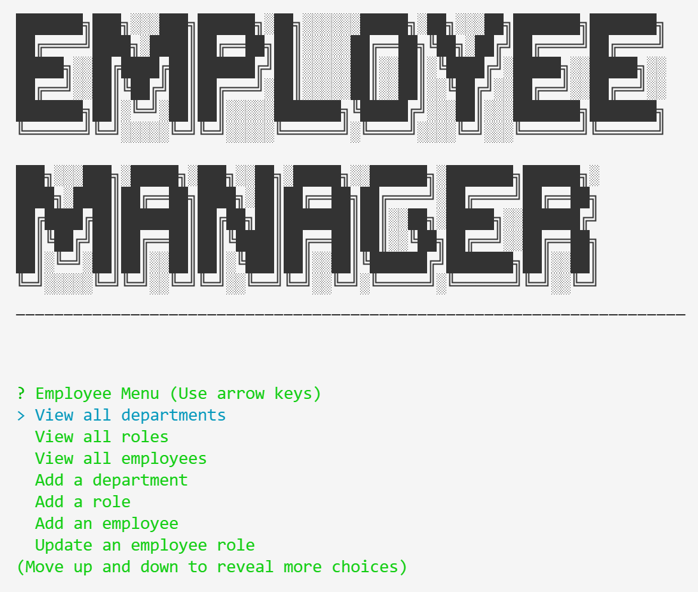
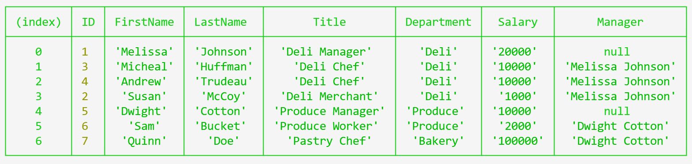

# Homework 12: Employee Tracker 

## Objective 

The goal of this assignment was to use various libraries like mysql2 & inquirer to make a console application to manage employees, departments, and roles.

## Changes

- Created Seeds and Schemas in the db folder that are called at startup
- Added SQL connections
- Added SQL query and execute commands
- Added Inquirer commands
- Linked the Inquirer to the query and execute commands 

## Links

[Github](https://github.com/andrewtrudeau/12-employee-tracker)

[Video](https://www.youtube.com/watch?v=DTk5K4Kvf-I)

## Screenshots

## Contact

If you wish to reach me for questions, please refer to the contact information below:

Github Profile: [andrewtrudeau](https://github.com/andrewtrudeau)

Email Me: [andrewtrudeau3@gmail.com](mailto:andrewtrudeau3@gmail.com)